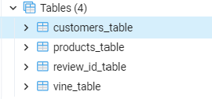
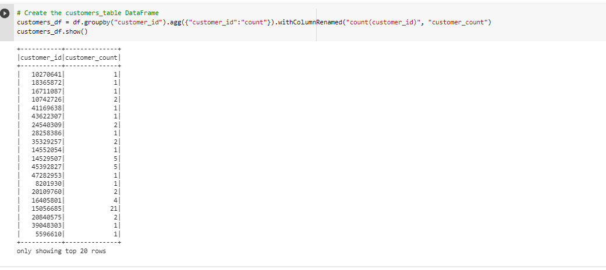
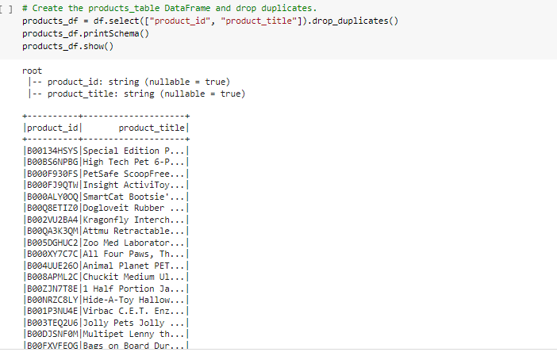
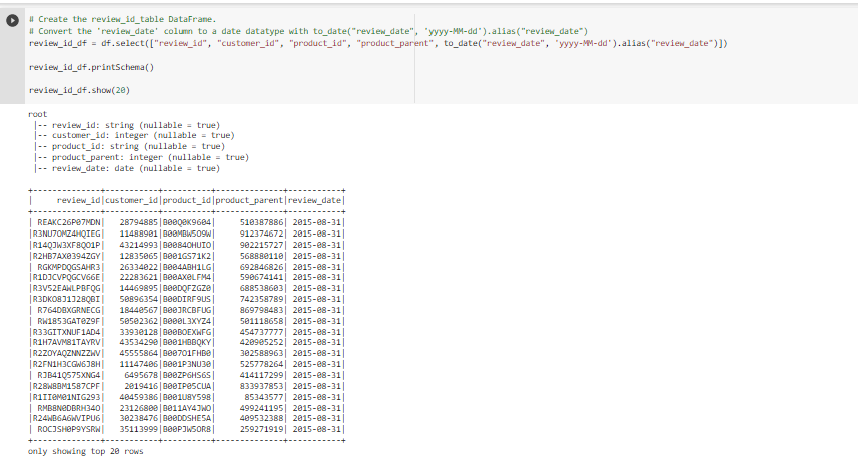
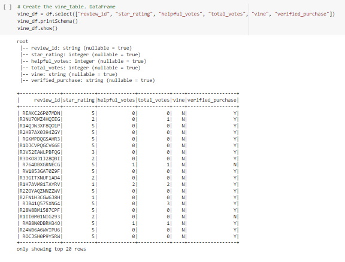
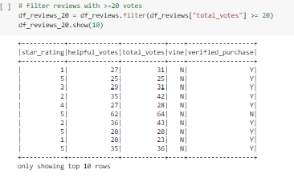
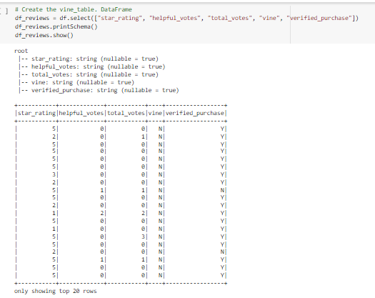

# Amazon_Vine_Analysis

ETL and meta-analysis of Amazon Vine reviews with AWS, postgresql, PySpark, and Google Colab

## Overview
The overarching purpose of this project was to conduct a meta-analysis of Amazon reviews. Specifically it was to analyze reviews produced as part of the Amazon Vine program, where select members of Amazon's reviewer community are compensated to review sample products. The primary goal of this inquiry is to determine if there is any bias towards favorable reviews from the paid Vine members in the available data.

Out of the 50 datasets of product categories available to chose from, I chose to analyze reviews in the Pet category - requiring experience and knowledge to effectively review. The initial ETL portion of the project was conducted, as prescribed, using AWS, postgresql, and PySpark in Google Colab. The data analysis segment was conducted using PySpark and Google Colab.

## Results
### Deliverable 1
Follow the instructions below to complete Deliverable 1.

- 1. From the following Amazon Review datasets (Links to an external site.), pick a dataset that you would like to analyze. All the datasets have the same schemata, as shown in this image:
- I picked Pets.

- 2. Create a new database with Amazon RDS just as you did in this module.

- 3. In pgAdmin, create a new database in your Amazon RDS server that you just create.

- 4. Download the challenge_schema.sql file to your computer.
	- See GitHub
In pgAdmin, run a new query to create the tables for your new database using the code from the challenge_schema.sql file.

-  5. After you run the query, you should have the following four tables in your database: 
	1 customers_table

	2 products_table

	3 review_id_table

	4 vine_table.

- 6. Download the Amazon_Reviews_ETL_starter_code.ipynb file, then upload the file as a Google Colab Notebook, and rename it Amazon_Reviews_ETL.
-		See GitHub

### Deliverable 2

To begin with, I filtered the available reviews to just those with more than 20 votes, and those which were more than 50% "helpful." 

Reviews with 20+ votes

More than 50% helpful

Calculations were made from this filtered dataset to address the following questions:

- How many Vine reviews and non-Vine reviews were there?
38010
 - How many Vine reviews were there? 
170
 - How many Vine reviews were 5 stars? 
65
 - How many non-Vine reviews were there?
 37840
 - How many non-Vine reviews were 5 stars?
20612
- What percentage of Vine reviews were 5 stars? 
38.24%
- What percentage of non-Vine reviews were 5 stars?
54.47%
# Summary

The following is the answers to the above questions:
- Out of a total of 38010 reviews in the dataset, 37840 (99.55%) were unpaid and 170 (0.45%) were paid reviews. 

- Out of a total of 20677 five-star reviews, 20612 (99.69%) were unpaid, while only 65 (00.31%) were paid. 

- Five-star reviews as percent of paid reviews Out of 170 total paid/Vine reviews, 65 (38.24%) were 5-star reviews. 

- Five-star reviews as percent of non-paid reviews Out of 37840 unpaid reviews, 20612 (54.47%) were 5-star reviews.
 
 What these numbers seems to suggest is that there is not strong bias toward five-star reviews from paid Amazon Vine reviewers. If anything, Vine reviews might show a tendency towards being more critical in their reviews. 
 
 This conclusion could be further examined by looking at the distribution of all star-levels across paid and unpaid reviews. Also, for a more thorough analysis, this same analysis should be conducted across a few different product catagories.
 